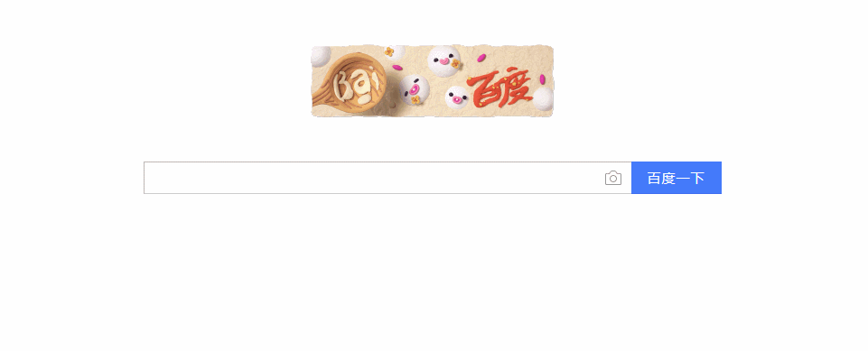

# SECool

一个是使搜索引擎出现一些酷酷效果的谷歌插件。

### 使用

1. 克隆地址，或者直接[下载代码](https://github.com/KaiOrange/SECool/archive/master.zip)并解压缩。
`git clone git@github.com:KaiOrange/SECool.git`
2. 点击谷歌浏览器地址栏最右侧的更多按钮（三个竖点），然后点击`更多工具`->`扩展程序`。
3. 选中标题栏右侧的`开发者选项`然后点击`已加载解压的扩展程序`并选择克隆下来的文件夹。
4. 进入[百度](https://www.baidu.com/)查看效果。

### 效果

（真是效果是很流畅的）

### 适配搜索引擎

[百度](https://www.baidu.com/),[搜狗](https://www.sogou.com/),[360搜索](https://www.so.com/),[必应](https://cn.bing.com/),[谷歌](https://www.google.com/)